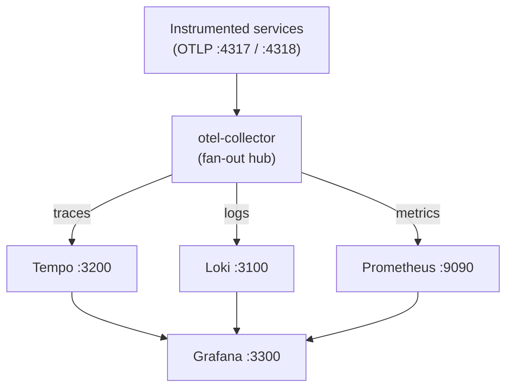

# Probes — Phase 0: Observability Infrastructure

Deck: `Rhizome::rhizome-lens` · See: docs/journal.md#phase-0--observability-infrastructure--2026-06-05

---
type: cloze
deck: Rhizome::rhizome-lens
tags: [observability, phase-0, collector]
---
The OTel Collector routes one OTLP stream to three backends by defining
{{c1::one pipeline per signal type}} under `service.pipelines` — each sharing
the same `otlp` receiver but terminating in its own {{c2::exporter}}.

Extra: rhizome-lens · Phase 0 · Pattern: Fan-Out Pipeline
See: docs/journal.md#phase-0--observability-infrastructure--2026-06-05

---
type: cloze
deck: Rhizome::rhizome-lens
tags: [observability, phase-0, collector]
---
The `loki` exporter ships only in the {{c1::contrib}} Collector image, not
`core`; using core omits the logs pipeline {{c2::silently}} — no startup error,
the pipeline just doesn't exist.

Extra: rhizome-lens · Phase 0 · Anti-Pattern Avoided: Core image for multi-backend
See: docs/journal.md#phase-0--observability-infrastructure--2026-06-05

---
type: cloze
deck: Rhizome::rhizome-lens
tags: [observability, phase-0, loki]
---
In Loki 3.x use schema {{c1::v13}} with {{c2::TSDB}}; v11/BoltDB-Shipper is
deprecated. A schema `from:` date set to today or the future makes Loki
{{c3::silently refuse ingestion}} until that date, so use a fixed past date.

Extra: rhizome-lens · Phase 0 · Anti-Pattern Avoided: Deprecated schema / future-dated from
See: docs/journal.md#phase-0--observability-infrastructure--2026-06-05

---
type: cloze
deck: Rhizome::rhizome-lens
tags: [observability, phase-0, docker]
---
A `CMD-SHELL` healthcheck fails in a distroless image like
`otel-collector-contrib` because Docker runs it via {{c1::/bin/sh -c}}, which
the image does not contain — marking the container {{c2::permanently unhealthy}}
even while the process runs fine. Use `healthcheck.disable: true` instead.

Extra: rhizome-lens · Phase 0 · Anti-Pattern Avoided: CMD-SHELL in distroless
See: docs/journal.md#phase-0--observability-infrastructure--2026-06-05

---
type: cloze
deck: Rhizome::rhizome-lens
tags: [observability, phase-0, ports]
---
Shared cross-project infra (Grafana) was moved to host port {{c1::3300}} rather
than the compose default 3000, because a container that loses a host-port race
still shows {{c2::healthy}} in `docker compose ps` — its healthcheck probes its
own internal localhost, blind to the host conflict.

Extra: rhizome-lens · Phase 0 · Anti-Pattern Avoided: Squatting the collided port
See: docs/journal.md#phase-0--observability-infrastructure--2026-06-05

---
type: cloze
deck: Rhizome::rhizome-lens
tags: [observability, phase-0, prometheus]
---
A panel querying `otelcol_receiver_accepted_spans_total` shows "No data" because
the real metric has {{c1::no `_total` suffix}}; Prometheus returns a valid
{{c2::empty result}} (not an error) for a nonexistent metric. Verify names via
`/api/v1/label/__name__/values`.

Extra: rhizome-lens · Phase 0 · Anti-Pattern Avoided: Trusting the _total suffix
See: docs/journal.md#phase-0--observability-infrastructure--2026-06-05

---
type: cloze
deck: Rhizome::rhizome-lens
tags: [observability, phase-0, collector]
---
The Collector's self-telemetry (`otelcol_*`) is served on port {{c1::8888}}
(`service.telemetry.metrics.address`), a different endpoint from the
{{c2::8889}} `prometheus` exporter that carries app-sent OTLP metrics — so each
needs its own Prometheus scrape job.

Extra: rhizome-lens · Phase 0 · Decision: Two jobs for two endpoints
See: docs/journal.md#phase-0--observability-infrastructure--2026-06-05

---
type: cloze
deck: Rhizome::rhizome-lens
tags: [observability, phase-0, otlp]
---
An OTLP/HTTP exporter returns {{c1::`{"partialSuccess":{}}`}} on *full* success,
not `{}`; a non-empty `partialSuccess` object listing `rejectedSpans` indicates
{{c2::partial rejection}}.

Extra: rhizome-lens · Phase 0 · Decision: OTLP success response
See: docs/journal.md#phase-0--observability-infrastructure--2026-06-05

---
type: cloze
deck: Rhizome::rhizome-lens
tags: [observability, phase-0, javascript]
---
Optional chaining `obj?.method(arg)` skips evaluating {{c1::arg}} too when `obj`
is nullish — so a throwing `Buffer.byteLength(...)` inside
`span?.setAttributes({...})` is unreachable in span-less `app.inject()` tests
yet 500s every real request under live auto-instrumentation.

Extra: rhizome-lens · Phase 0 · Challenge: 44 tests pass with a 500 on every request
See: docs/journal.md#phase-0--observability-infrastructure--2026-06-05

---
type: cloze
deck: Rhizome::rhizome-lens
tags: [observability, phase-0, tempo, grafana]
---
On Grafana 11.2 the `/api/ds/query` Tempo endpoint accepts only query type
{{c1::traceId}}; TraceQL *search* goes through a separate {{c2::CallResource}}
route. To validate a TraceQL search headlessly, hit Tempo's own
{{c3::/api/search}} directly.

Extra: rhizome-lens · Phase 0 · Challenge: ds/query rejects traceqlSearch
See: docs/journal.md#phase-0--observability-infrastructure--2026-06-05

---
type: cloze
deck: Rhizome::rhizome-lens
tags: [observability, phase-0, docker, wsl2]
---
`docker info` succeeding does {{c1::not}} prove `docker compose up` will work:
the CLI may target a remote daemon over {{c2::TCP}} while Compose looks for the
local `/var/run/docker.sock`. Check the socket exists explicitly.

Extra: rhizome-lens · Phase 0 · Challenge: docker info succeeds, compose fails
See: docs/journal.md#phase-0--observability-infrastructure--2026-06-05

---
type: cloze
deck: Rhizome::rhizome-lens
tags: [observability, phase-0, curl]
---
`curl -s` to a PromQL range-vector query returns zero bytes because curl's
{{c1::URL globbing}} tries to interpret `[5m]` and errors pre-request; fix with
{{c2::-g (--globoff)}} or `-G --data-urlencode`.

Extra: rhizome-lens · Phase 0 · Challenge: curl -s returns empty on [5m]
See: docs/journal.md#phase-0--observability-infrastructure--2026-06-05

---
type: basic
deck: Rhizome::rhizome-lens
tags: [observability, phase-0, docker]
---
Q: Why disable the otel-collector healthcheck entirely rather than add a probe
or swap to a non-distroless image?

A: The in-container `health_check` extension already reports readiness on its
own endpoint, so Docker's healthcheck status is purely cosmetic for local dev —
not gating any `depends_on`. Disabling is the lowest-churn honest option. The
proper fix (a thin wrapper image or the non-distroless variant) is only
warranted if a real liveness gate is later needed; faking a probe to turn the
status green would be the actual anti-pattern.

Extra: rhizome-lens · Phase 0 · Decision: Disable rather than fake the probe
See: docs/journal.md#phase-0--observability-infrastructure--2026-06-05

---

---
type: image-occlusion
deck: Rhizome::rhizome-lens
tags: [observability, phase-0, topology]
diagram: phase-0-fanout-topology
---
occlusions:
  - node: COL
    hint: what component receives all OTLP signals and fans them out?
    rect: left=.38:top=.16:width=.26:height=.10
  - node: TEM
    hint: which backend stores traces?
    rect: left=.06:top=.44:width=.24:height=.10
  - node: LOK
    hint: which backend stores logs?
    rect: left=.38:top=.44:width=.24:height=.10
  - node: PRM
    hint: which backend stores metrics?
    rect: left=.70:top=.44:width=.26:height=.10
  - node: GRA
    hint: what single pane visualizes all three signal stores?
    rect: left=.38:top=.74:width=.26:height=.10

Header: OTel pillar-stack fan-out topology
Back Extra: rhizome-lens · Phase 0 · Pattern: Fan-Out Pipeline
See: docs/journal.md#phase-0--observability-infrastructure--2026-06-05
