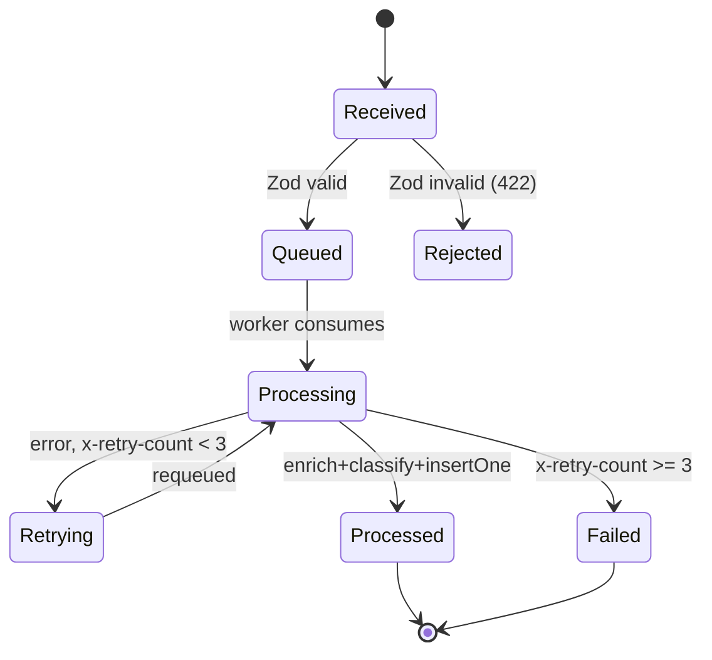

# Skill: Journal & Anki Probe Generation (journal-anki)

_Last re-synced with the user-level copy (`~/.claude/skills/journal-anki.md`): 2026-07-06.
Previous copy was frozen at 2026-06-12 (this repo's original adoption commit),
four days before the user-level copy moved to the per-file/`cross_ref_id`
convention on 2026-06-16 — a staleness gap, not an intentional fork. This
re-sync keeps this repo's own `docs/journal.md`/`docs/probes/phase-N-*.md`
framing (explicitly allowed by "Cross-Repo Reference" below) but otherwise
matches the user-level spec. If a future divergence is found, check
`git log -- skills/journal-anki.md` in both places before assuming which
one is stale — don't just trust whichever copy you're looking at._

## Description
Maintains a per-repo engineering journal (`docs/journal.md`, this repo's
own single-file convention rather than one-file-per-entry) using typed,
vocabulary-enforced sections, and generates paired Anki probe files
(`docs/probes/phase-N-<name>.md`) for spaced-repetition review. Runs at the
end of every phase, before proposing a commit.

This is the authoritative spec for this repo. Per-repo `CLAUDE.md` files
MUST explicitly reference the user-level copy at
`~/.claude/skills/journal-anki.md` and state the trigger condition plainly
(see "Required CLAUDE.md wiring" below). If this copy and the user-level
copy diverge again in the future, treat that as a staleness bug to
diagnose (see the note above), not an automatic "local wins."

**Known gap as of 2026-07-06: this repo has no `CLAUDE.md` at all**, so the
"Required CLAUDE.md wiring" rule below isn't actually satisfied here yet —
flagged, not fixed as part of this re-sync (out of scope for a skill-file
sync).

Claude Code owns all card-generation intelligence — note type selection,
Cloze gapping, Image Occlusion bounding box estimation, vocabulary
enforcement. Claude Desktop / `anki_sync.py` are dumb: they move files and
sync to AnkiConnect, nothing more.

## Required CLAUDE.md wiring
Every repo using this skill must have a section in its `CLAUDE.md` (not
merely a mention of a journal file) stating, in substance: "At the end of any
development phase, before proposing a commit, follow the journal-anki skill
at `~/.claude/skills/journal-anki.md` to write a journal entry." Repos that
instead maintain their own bespoke logging convention (`LEARNING_LOG.md`,
ad hoc Q:/A: blocks, etc.) must either migrate to this skill (see §3,
"Retroactive migration") or explicitly opt out — silent divergence is the
failure mode this section exists to prevent.

## Trigger
- End of a development phase, before proposing a commit message.
- "Journal this phase" / "update the journal."
- A repo's CLAUDE.md explicitly invokes this skill (see "Required CLAUDE.md
  wiring" above) — merely referencing `docs/journal.md` is not sufficient.

## Cross-Repo Reference
Cross-cutting entries that touch an integration boundary (Synapse→Sentinel,
EventHorizon→RabbitMQ, etc.), written in a repo using the per-file
`docs/journal/` convention, carry `cross_ref: observability` plus a
`cross_ref_id` in their frontmatter and are mirrored here, to
`rhizome-observability/docs/journal.md`.

The mirrored entry in this repo carries the *same* `cross_ref_id` value
(as a header line — see "Entry header" below, since this repo doesn't use
YAML frontmatter blocks) — this is the only thing that must match exactly;
title, prose, and phase numbering here are free to follow this repo's own
framing rather than a verbatim copy. Matching on `cross_ref_id` (rather
than title or phase-number similarity) is what allows mirroring gaps to be
detected mechanically: diff the set of `cross_ref_id` values referenced
across source repos against the set of `cross_ref_id:` header lines
actually present in this file, and report anything missing.

---

## 1. Journal Entry Format

### Entry header
```markdown
## Phase N — <Name> — YYYY-MM-DD
cross-ref: observability        ← include only when entry touches an integration boundary
cross_ref_id: <source repo's exact id>   ← required whenever cross-ref is present; must match the source entry's cross_ref_id exactly
Files: path/to/file.ts, path/to/other.ts
```

### Typed sections (mandatory anchors)
Write prose within each section — not bullet summaries. Name the formal
distributed-systems term before any casual explanation (see §5).

```markdown
### Pattern: <Formal Pattern Name>
Prose. Name the concept formally first, then explain how it manifests in this
specific implementation — not a textbook definition.

### Anti-Pattern Avoided: <Formal Anti-Pattern Name>
The trap, why it was tempting, and the specific failure mode it sidesteps.

### Challenge: <Short Label>
Symptom, root cause, fix. Omit this section entirely if no real challenge
occurred — do not write filler.

### Decision: <Short Label>
The chosen path, explicit tradeoffs, what was deferred or rejected and why.
```

Multiple Pattern or Decision entries are allowed per phase. Challenge is
omitted, never faked.

---

## 2. Probe File Format

Probes live in a separate file per phase, co-located with the journal:

```
docs/
  journal.md
  probes/
    phase-N-<name>.md     ← one file per phase
```

Each probe file contains: Cloze and Basic cards for that phase, named Mermaid
blocks referenced by cards, and Image Occlusion cards with Claude-estimated
bounding box coordinates.

### Cloze with Extra Field (default)
```markdown
---
type: cloze
deck: Rhizome::<repo-name>
tags: [<repo>, phase-N, <topic>]
---
{{c1::XCLAIM}} is the Redis Streams command used to reclaim messages from a
crashed consumer in an at-least-once delivery model.

Extra: sentinel-l7 · Phase 3 · Anti-Pattern Avoided: Silent Message Drop
See: docs/journal.md#phase-3
```
Use for: terminology, cause-effect, fill-in-the-formal-term. Default for
almost everything — see §4 for the decision procedure.

### Basic (fallback of last resort)
```markdown
---
type: basic
deck: Rhizome::<repo-name>
tags: [<repo>, phase-N, <topic>]
---
Q: Why did we choose poll-based entitlement enforcement over a push model in
Ledger-L5?

A: Because push requires Ledger-L5 to maintain an open connection or webhook
to each consumer, coupling availability. Poll with TTL cache lets consumers
fail open and recover independently — entitlement state is owned by one
service but not on its critical path.

Extra: ledger-l5 · Phase 2 · Decision: Fail-Open Entitlement
See: docs/journal.md#phase-2
```
Use only when the answer is a genuine multi-clause paragraph that resists
cloze gapping — typically a tradeoff or "why X over Y" reasoning chain. This
should be rare. See §4.

### Mermaid diagram block
Named blocks live in the same probe file, referenced by cards:

````markdown

````

### Image Occlusion
AnkiConnect note type `"Image Occlusion"` is verified available, with fields
`Occlusion`, `Image`, `Header`, `Back Extra`, `Comments`. Fully automated: the
sync script renders the named Mermaid block to PNG via mermaid.ink, stores it
as Anki media, and constructs the `Occlusion` field from the bounding box
coordinates below.

**Correction from the pre-2026-07-06 copy of this file:** that version
claimed "Image Occlusion via AnkiConnect is not supported" and treated a
manual placeholder-card workflow as "the permanent solution, not a stopgap."
That claim didn't hold up — Image Occlusion is supported. Any existing
`image-occlusion-placeholder` cards in this repo's `docs/probes/` predate
that correction and should be converted the next time they're touched, not
treated as the intended end state.

Triggered when the concept is a state machine, pipeline, or topology where
spatial recall beats prose recall.

```markdown
---
type: image-occlusion
deck: Rhizome::<repo-name>
tags: [<repo>, phase-N, <topic>]
diagram: phase-N-eventhorizon-pipeline
---
occlusions:
  - node: Queued
    hint: what state follows a valid POST /events?
    rect: left=.35:top=.28:width=.22:height=.09
  - node: Retrying
    hint: what state handles transient worker errors?
    rect: left=.35:top=.55:width=.22:height=.09
  - node: Failed
    hint: terminal state when x-retry-count >= 3?
    rect: left=.52:top=.72:width=.18:height=.09

Header: <diagram title>
Back Extra: <repo> · Phase N · Pattern: <Formal Name>
See: docs/journal.md#phase-N
```

`diagram:` references a named Mermaid block (`#<name>`) in the same probe
file. `rect` coordinates are normalized (0–1) against the rendered PNG:
`left`/`top` is the corner, `width`/`height` is the box size.

Bounding box coordinates are Claude's best estimate from diagram structure —
not pixel-measured. Flag blue (flag 4) on Android if a region is visibly
wrong; corrections are made at the next session start, not from the phone.

**Deferred optimization:** replace estimated coordinates with programmatic
image processing (Pillow + OpenCV contour detection + pytesseract label
matching on light-theme renders) — only worth pursuing if estimated coords
require frequent blue-flag corrections in practice.

---

## 3. Two-Pass Interactive Generation

Runs at the end of every phase, before proposing a commit.

### Flagged card review (session start)
Before Pass 1, query AnkiConnect for `findNotes("flag:4 deck:Rhizome")` and
present any blue-flagged cards from the previous session — ask what needs
changing and resolve before drafting. No format decisions are made on the
phone; flagging on Android just queues a card for re-evaluation here.

### Pass 1 — Skeleton draft
Generate: a new `## Phase N` section appended to `docs/journal.md` with
files changed, `cross-ref`/`cross_ref_id` header lines if this entry
mirrors another repo's cross-cutting entry, Pattern/Anti-Pattern entries
inferred from the diff, tentative Decision entries, and a draft probe file
(`docs/probes/phase-N-<name>.md`) with initial cards — including Image
Occlusion cards with estimated bounding box coordinates where applicable.
Apply the note-type decision procedure (§4) to every card during this pass
— do not default to Basic.

### Pass 2 — Elicitation
Always ask:
1. "What was the hardest part of this phase?"
2. "Anything you'd do differently?"

Plus one targeted question if uncertain about a specific pattern or decision —
only if needed, never padded to three for its own sake.

After the answers:
- Finalise all typed sections with the user's texture.
- Finalise `tags` — review the draft list against §5's vocabulary check;
  every formally-named term should generally appear as a tag.
- Flag any section using casual language where a formal term exists (§5).
- Finalise the probe file, including Image Occlusion cards with estimated
  bounding box coordinates.
- Propose the commit message — journal update and probe file committed
  together.

### Retroactive migration (existing LEARNING_LOG.md → docs/journal.md)
Already completed for this repo (`docs(journal): migrate LEARNING_LOG to
journal + Anki probes`) — retained below for reference if another legacy
log is ever migrated into this same file.

For a one-time migration of historical entries, Pass 2's per-entry
elicitation is replaced by a single consolidated review:
- **Automated pass** — Claude converts without asking: split the legacy file
  into one `## Phase N` section per phase/section in `docs/journal.md`,
  assigning each a phase number derived from the original commit date (or
  phase date) — real timestamps are preferred over invented ones whenever
  the source material gives a date; rename section headers to typed format;
  reformat Q/A blocks into probe cards per §4 (do not default to Basic — see
  "Conversion from legacy Q:/A: format" below); generate Image Occlusion
  cards with estimated bounding box coordinates for any entry referencing a
  state machine, pipeline diagram, or topology; and add `cross-ref:
  observability` plus a `cross_ref_id:` header line to entries mirroring
  another repo's cross-cutting entry.
- **Flagged for interactive review** — present as a single numbered list after
  the automated pass: sections where the original prose is too thin to name a
  formal term, Decision entries where the tradeoff isn't explicit in the
  source, Q/A blocks that test "what" instead of "why," any uncertain
  cross-ref marker, and — specific to migration — any case where the source
  file gives no usable date for the phase number. Resolve this list in one
  session, not entry by entry.
- **Mirror reconciliation** — when another repo's `docs/journal/` has
  entries with `cross_ref: observability` set, check whether each resulting
  `cross_ref_id` already has a corresponding `cross_ref_id:` header line
  somewhere in this repo's `docs/journal.md`. Report any that don't as a
  consolidated list rather than mirroring silently.

---

## 4. Note Type Selection Logic

**Default is Cloze with Extra Field.** Basic is the fallback of last resort,
not the default. When in doubt, make it Cloze.

### Decision procedure — apply per card, in order

**Step 1:** Does the concept involve a state machine, pipeline, topology, or
any structure where spatial layout carries meaning?
→ **Image Occlusion.** Generate the Mermaid block and estimated bounding box
coordinates. Stop.

**Step 2:** Can the core of the answer be expressed as a sentence with one or
more meaningful gaps?
→ **Cloze with Extra Field.** Gap the formal term, the causal mechanism, or
the specific threshold/value. Stop.

Test: if you can write `{{c1::X}}` where X is a formal term or specific fact
and the surrounding sentence still makes sense as a prompt, it's Cloze.

**Step 3:** Is the answer genuinely a multi-clause paragraph where no single
gap captures the point — typically a tradeoff, a "why we chose X over Y," or
a nuanced reasoning chain?
→ **Basic.** This should be rare.

### Conversion from legacy Q:/A: format
`LEARNING_LOG.md` Q:/A: pairs carry no type signal. Every pair must be
evaluated against the procedure above during the LL → probe conversion step.
Do not carry the Q:/A: format forward as Basic by default — that is the error
this procedure exists to prevent.

### Cloze gapping guidance
Gap the thing most likely to be forgotten: the formal term, the command name,
the threshold, the causal direction. Not the entire answer.

```
✓ {{c1::XCLAIM}} is used to reclaim messages from a crashed consumer
✗ XCLAIM is used to {{c1::reclaim messages from a crashed consumer}}
```

Multiple gaps per card are allowed when distinct facts each warrant recall:
```
{{c1::XCLAIM}} reclaims messages held by a {{c2::dead consumer group member}}
```

### Stated default
If the decision procedure produces genuine ambiguity: **Cloze.** Never Basic
by default.

Claude decides the type; flag blue (flag 4) on Android to queue for
re-evaluation — no format decisions from the phone, flag and defer to the
next session.

---

## 5. Vocabulary Enforcement

Before finalising any typed section, check:
- Is there a formal distributed-systems term for this concept?
- Is it named before the casual explanation?

Examples: at-least-once delivery, competing consumers, head-of-line blocking,
idempotent receiver, circuit breaker, backpressure, fan-out, XCLAIM,
traceparent, semantic cache, policy epoch invalidation.

If a section uses only casual language, flag it and propose the formal term
before finalising.

---

## Deck Naming

| Repo | Anki deck |
|---|---|
| sentinel-l7 | `Rhizome::sentinel-l7` |
| EventHorizon | `Rhizome::EventHorizon` |
| synapse-l4 | `Rhizome::synapse-l4` |
| Ledger-L5 | `Rhizome::ledger-l5` |
| (cross-cutting) | `Rhizome::observability` |
