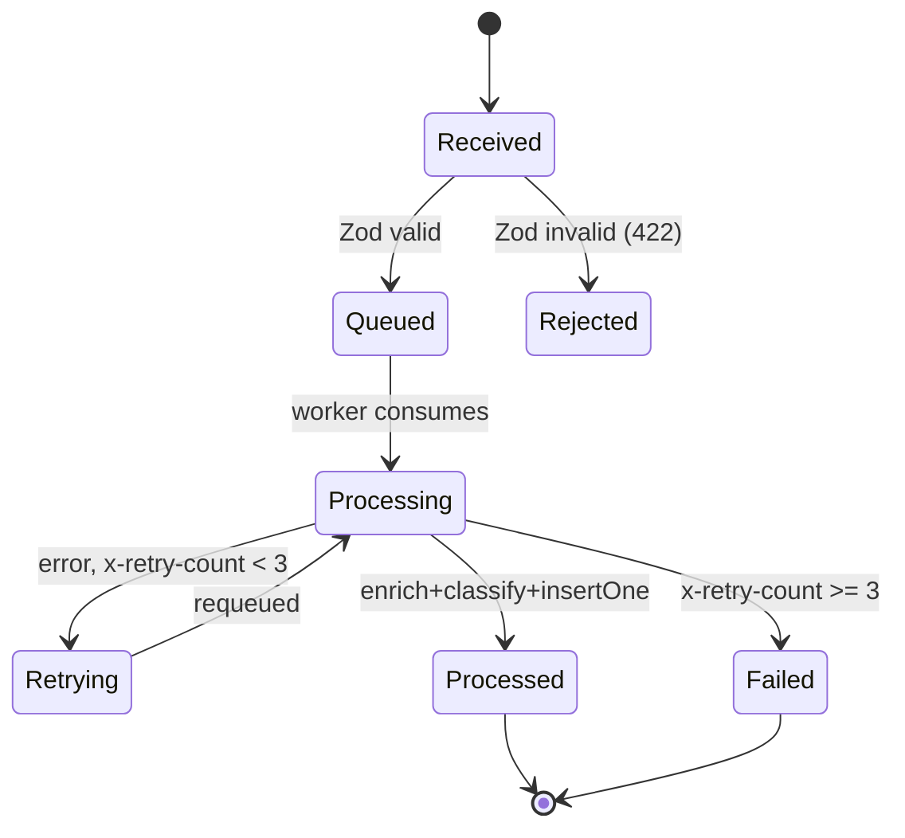

# Skill: Journal & Anki Probe Generation (journal-anki)

## Description
Maintains a per-repo engineering journal (`docs/journal.md`) using typed,
vocabulary-enforced sections, and generates paired Anki probe files
(`docs/probes/phase-N-<name>.md`) for spaced-repetition review. Runs at the
end of every phase, before proposing a commit.

This is the authoritative spec. Per-repo `CLAUDE.md` files reference the
user-level copy at `~/.claude/skills/journal-anki.md`. If the two diverge,
this repo's copy wins — re-sync the user-level copy from here.

## Trigger
- End of a development phase, before proposing a commit message.
- "Journal this phase" / "update the journal."
- A repo's CLAUDE.md references `docs/journal.md`.

## Cross-Repo Reference
Cross-cutting entries that touch an integration boundary (Synapse→Sentinel,
EventHorizon→RabbitMQ, etc.) carry `cross-ref: observability` in the entry
header and are mirrored to:
`\\wsl$\Ubuntu\home\amanda\dev\rhizome-observability\docs\journal.md`

---

## 1. Journal Entry Format

### Entry header
```markdown
## Phase N — <Name> — YYYY-MM-DD
cross-ref: observability        ← include only when entry touches an integration boundary
Files: path/to/file.ts, path/to/other.ts
```

### Typed sections (mandatory anchors)
Write prose within each section — not bullet summaries. Name the formal
distributed-systems term before any casual explanation (see §5).

```markdown
### Pattern: <Formal Pattern Name>
Prose. Name the concept formally first, then explain how it manifests in this
specific implementation — not a textbook definition.

### Anti-Pattern Avoided: <Formal Anti-Pattern Name>
The trap, why it was tempting, and the specific failure mode it sidesteps.

### Challenge: <Short Label>
Symptom, root cause, fix. Omit this section entirely if no real challenge
occurred — do not write filler.

### Decision: <Short Label>
The chosen path, explicit tradeoffs, what was deferred or rejected and why.
```

Multiple Pattern or Decision entries are allowed per phase. Challenge is
omitted, never faked.

---

## 2. Probe File Format

Probes live in a separate file per phase, co-located with the journal:

```
docs/
  journal.md
  probes/
    phase-N-<name>.md     ← one file per phase
```

Each probe file contains: Cloze and Basic cards for that phase, named Mermaid
blocks referenced by cards, and Image Occlusion placeholder cards.

### Cloze with Extra Field (default)
```markdown
---
type: cloze
deck: Rhizome::<repo-name>
tags: [<repo>, phase-N, <topic>]
---
{{c1::XCLAIM}} is the Redis Streams command used to reclaim messages from a
crashed consumer in an at-least-once delivery model.

Extra: sentinel-l7 · Phase 3 · Anti-Pattern Avoided: Silent Message Drop
See: docs/journal.md#phase-3
```
Use for: terminology, cause-effect, fill-in-the-formal-term. Default for
almost everything.

### Basic (fallback)
```markdown
---
type: basic
deck: Rhizome::<repo-name>
tags: [<repo>, phase-N, <topic>]
---
Q: Why did we choose poll-based entitlement enforcement over a push model in
Ledger-L5?

A: Because push requires Ledger-L5 to maintain an open connection or webhook
to each consumer, coupling availability. Poll with TTL cache lets consumers
fail open and recover independently — entitlement state is owned by one
service but not on its critical path.

Extra: ledger-l5 · Phase 2 · Decision: Fail-Open Entitlement
See: docs/journal.md#phase-2
```
Use only when the answer is a genuine paragraph that resists cloze gapping.
Tradeoff reasoning is the primary use case.

### Mermaid diagram block
Named blocks live in the same probe file, referenced by cards:

````markdown

````

### Image Occlusion placeholder
Triggered when the concept is a state machine, pipeline, or topology where
spatial recall beats prose recall.

```markdown
---
type: image-occlusion-placeholder
deck: Rhizome::<repo-name>
tags: [<repo>, phase-N, <topic>, needs-manual-creation]
---
ACTION REQUIRED: Create Image Occlusion card manually in Anki desktop.

Concept: <what the diagram tests — e.g. test recall of each state
transition individually by occluding one node at a time>

Source diagram: #phase-N-<name> (see Mermaid block above)

Suggested occlusion regions:
- Occlude "<Node>" — <question this tests>

Steps:
1. Render the Mermaid block above to PNG (paste source at mermaid.live)
2. In Anki desktop: Add → Image Occlusion → import PNG
3. Draw rectangles over each suggested region
4. Add to deck: Rhizome::<repo-name>
5. Delete this placeholder card after creation
```

Image Occlusion via AnkiConnect is not supported — this placeholder workflow
is the permanent solution, not a stopgap pending an API fix.

---

## 3. Two-Pass Interactive Generation

Runs at the end of every phase, before proposing a commit.

### Flagged card review (session start)
Before Pass 1, query AnkiConnect for `findNotes("flag:4 deck:Rhizome")` and
present any blue-flagged cards from the previous session — ask what needs
changing and resolve before drafting.

### Pass 1 — Skeleton draft
Generate: entry header with files changed, Pattern/Anti-Pattern entries
inferred from the diff, tentative Decision entries, and a draft probe file
with placeholder cards.

### Pass 2 — Elicitation
Always ask:
1. "What was the hardest part of this phase?"
2. "Anything you'd do differently?"

Plus one targeted question if uncertain about a specific pattern or decision —
only if needed, never padded to three for its own sake.

After the answers:
- Finalise all typed sections with the user's texture.
- Flag any section using casual language where a formal term exists (§5).
- Finalise the probe file, including Image Occlusion placeholders.
- Propose the commit message — journal file and probe file committed together.

---

## 4. Note Type Selection Logic

| Content type | Note type |
|---|---|
| Terminology, formal concept, cause-effect | Cloze with Extra |
| Tradeoff reasoning, multi-sentence "why" | Basic |
| State machine, pipeline, topology | Image Occlusion placeholder |

Claude decides the type. Flag blue (flag 4) on Android to queue for
re-evaluation — no format decisions from the phone; flag and defer to the
next session.

---

## 5. Vocabulary Enforcement

Before finalising any typed section, check:
- Is there a formal distributed-systems term for this concept?
- Is it named before the casual explanation?

Examples: at-least-once delivery, competing consumers, head-of-line blocking,
idempotent receiver, circuit breaker, backpressure, fan-out, XCLAIM,
traceparent, semantic cache, policy epoch invalidation.

If a section uses only casual language, flag it and propose the formal term
before finalising.

---

## Deck Naming

| Repo | Anki deck |
|---|---|
| sentinel-l7 | `Rhizome::sentinel-l7` |
| EventHorizon | `Rhizome::EventHorizon` |
| synapse-l4 | `Rhizome::synapse-l4` |
| Ledger-L5 | `Rhizome::ledger-l5` |
| (cross-cutting) | `Rhizome::observability` |
